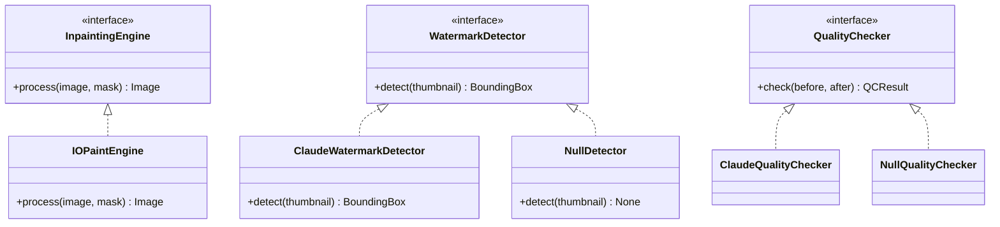
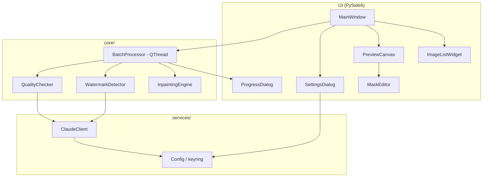
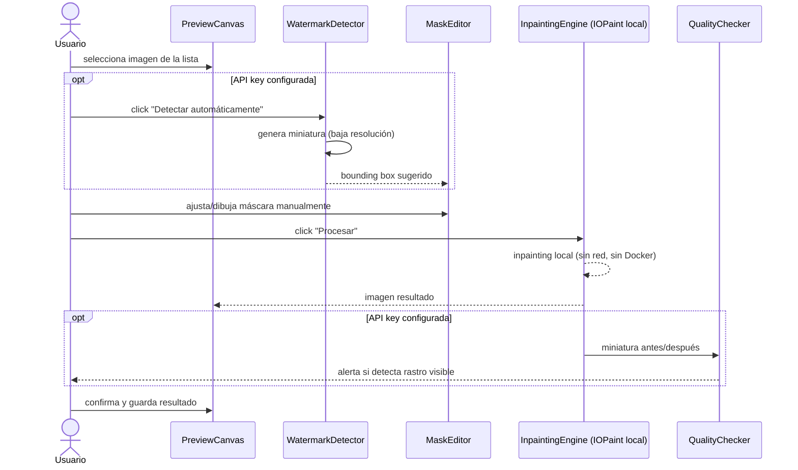
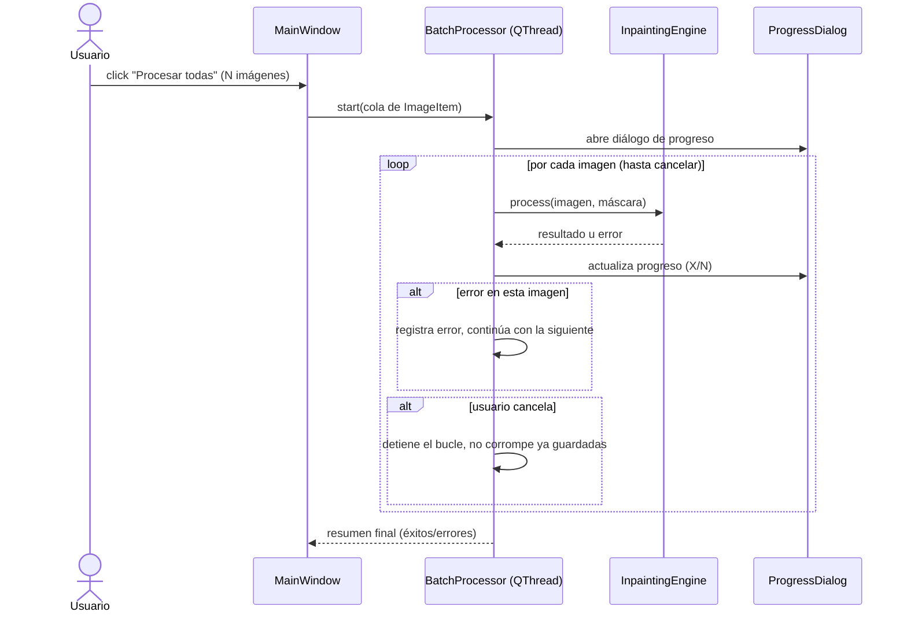

# Arquitectura técnica detallada

> Ver también: [Arquitectura (visión general)](overview.md) · [Product Backlog](../scrum/product_backlog.md)

Complementa [overview.md](overview.md) con el diseño de módulos, interfaces y flujos, sin entrar todavía en código (fase de planeación).

## 1. Layout de carpetas planeado

```
src/watermark_remover/
├── main.py                     # entry point: crea QApplication y MainWindow
├── ui/
│   ├── main_window.py          # MainWindow: layout general, toolbar, menú
│   ├── image_list_widget.py    # lista/galería con multi-select y drag&drop
│   ├── preview_canvas.py       # vista previa + overlay de máscara
│   ├── mask_editor.py          # lógica de dibujo/ajuste de rectángulo o máscara libre
│   ├── progress_dialog.py      # progreso de lote + cancelar
│   └── settings_dialog.py      # configurar API key de Claude, carpeta de salida
├── core/
│   ├── image_item.py           # dataclass: ruta, miniatura, máscara, estado, resultado
│   ├── batch_processor.py      # orquesta la cola de ImageItem por el pipeline (QThread)
│   ├── inpainting_engine.py    # interfaz InpaintingEngine + implementación IOPaintEngine
│   ├── watermark_detector.py   # interfaz WatermarkDetector + ClaudeWatermarkDetector + NullDetector
│   └── quality_checker.py      # interfaz QualityChecker + ClaudeQualityChecker + NullQualityChecker
├── services/
│   ├── claude_client.py        # wrapper del SDK Anthropic; reduce imagen antes de enviar
│   └── config.py               # carga/guarda config (API key vía keyring, carpeta salida)
└── utils/
    ├── image_utils.py          # miniaturas, downscaling, conversión de formato
    └── file_utils.py           # nombres de salida seguros, evita sobrescritura
```

## 2. Principio de diseño clave: Strategy + Null Object

`InpaintingEngine`, `WatermarkDetector` y `QualityChecker` son **interfaces (Strategy)**. Esto permite:
- Que el motor de inpainting sea intercambiable (hoy IOPaint/LaMa local; mañana otro sin tocar el resto de la app).
- Que las funciones de Claude sean **opcionales**: si no hay API key, `NullDetector`/`NullQualityChecker` se usan automáticamente (Null Object pattern) y la UI oculta esas opciones — nunca hay error por falta de key.
- Que en tests (HU-10) se puedan mockear `InpaintingEngine`/`WatermarkDetector` sin depender de IOPaint real ni de red.



## 3. Componentes y responsabilidades



## 4. Flujo — imagen individual (con asistencia opcional de Claude)



## 5. Flujo — procesamiento por lotes



## 6. Manejo de configuración y secretos

- La API key de Anthropic **nunca** se guarda en texto plano en el repo ni en config versionable.
- `services/config.py` la persiste vía `keyring` (almacén seguro del SO) o variable de entorno `ANTHROPIC_API_KEY`.
- `SettingsDialog` permite ingresarla/borrarla en tiempo de ejecución.
- Ausencia de key → `ClaudeWatermarkDetector`/`ClaudeQualityChecker` no se instancian; se usan `NullDetector`/`NullQualityChecker` y la UI oculta los botones correspondientes.

## 7. Puntos de prueba (testability) pensados para HU-10

- `InpaintingEngine` y `WatermarkDetector` son interfaces → en tests se inyectan fakes/mocks, sin necesitar IOPaint real ni red.
- `BatchProcessor` se prueba con una cola de `ImageItem` falsos y un engine mock que simula éxito/error, verificando que el lote continúa tras un fallo individual (AC de HU-8).
- `ClaudeClient` se prueba con el SDK de Anthropic mockeado (sin llamadas reales) para validar que reduce la imagen antes de "enviarla" y que maneja ausencia de key sin lanzar excepción.
